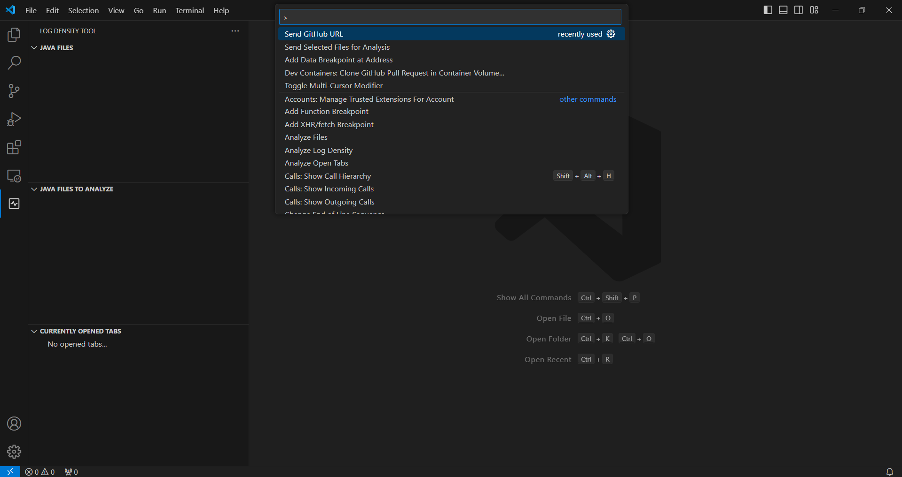
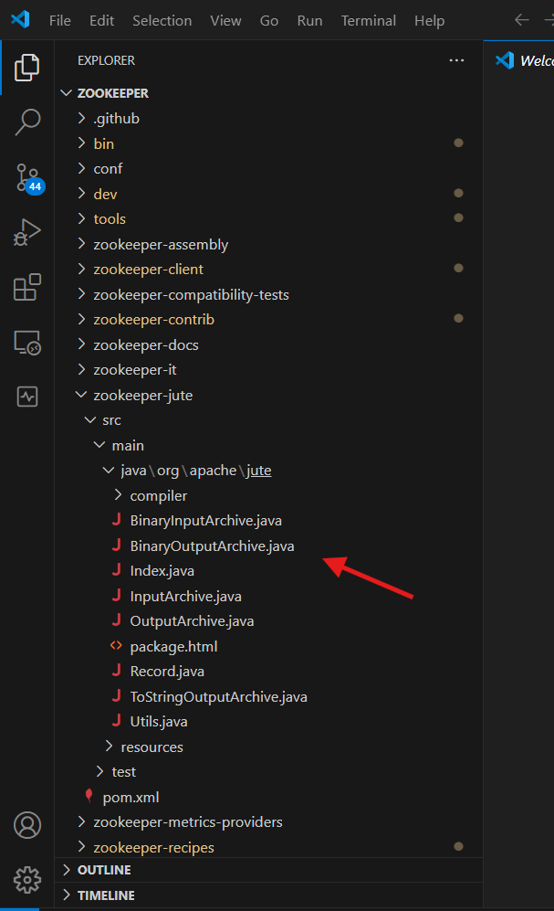
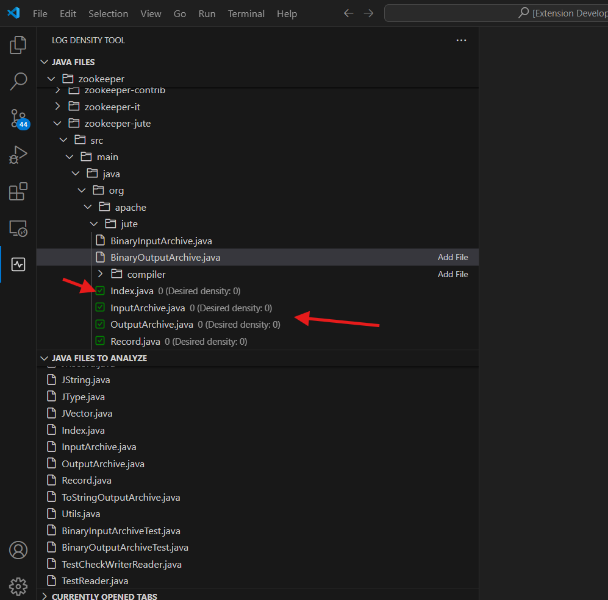

# Guide d'utilisation de l'extension "Log Density Tool"

## Table des matières

1. [Introduction](#1-introduction)
2. [Configuration](#2-configuration)
3. [Démarrage](#3-démarrage)
4. [Utilisation de l'extension](#4-utilisation-de-lextension)
   - [Créer un modèle d'apprentissage AI](#41-créer-un-modèle-dapprentissage-ai)
   - [Analyser un fichier JAVA pour obtenir la densité d’instructions de journalisation appropriée](#42-analyser-un-fichier-java-pour-obtenir-la-densité-dinstructions-de-journalisation-appropriée)
   - [Analyser plusieurs fichiers JAVA pour obtenir la densité d’instructions de journalisation appropriée](#43-analyser-plusieurs-fichiers-java-pour-obtenir-la-densité-dinstructions-de-journalisation-appropriée)

## 1. Introduction
Bienvenue dans le guide d'utilisation de l'extension "Log Density Tool", conçue pour suggérer la densité d’instructions de journalisation appropriée pour un fichier Java donné. Ce guide facilitera votre prise en main de l'outil.

## 2. Configuration
- Faire "npm install" dans le dossier "logdensitytool" pour être capable de lancer l'extension.

## 3. Démarrage
- Lancer l'extension en appuyant sur le bouton F5.

## 4. Utilisation de l'extension
### 4.1 Créer un modèle d'apprentissage AI
- Accéder aux commandes du menu de la barre de recherche en appuyant sur Ctrl + Shift + P.

- Taper "Send GitHub URL" dans la barre de recherche et sélectionnez cette option.

- Saisir l'URL d'un projet GitHub. Si un modèle AI a déjà été entraîné sur un même projet, l'entraînement 
ne se fera pas de nouveau et un message s'affiche à l'utilisateur pour l'avertir que le modèle a déjà été entraîné. 

- Attendre que l'entraînement du modèle finisse. Une fois l'entraînement terminé, les fichiers du modèle entraîné se     trouvent dans le sous-dossier "training_data" du dossier "services" dans l'explorateur de fichiers.

### 4.2 Analyser un fichier JAVA pour obtenir la densité d’instructions de journalisation appropriée
- Ouvrir le projet qui a été entraîné en cliquant sur open folder et en allant sélectionner son dossier dans training_data.

- Ouvrir le fichier JAVA désiré en cliquant dessus depuis l'explorateur de fichier qui se trouve dans la fenêtre qui a été ouverte après avoir pesé sur F5 au début.

- Visualiser dans le fichier ouvert la densité actuelle et la densité désirée affichées sous forme de catégories une fois qu'elles apparaissent dans le fichier. L'analyse se fait automatiquement à l'ouverture du fichier. Il est possible 
de voir les fichiers ouverts dans la vue "CURRENTLY OPENED TABS" et de faire une analyse pour obtenir les densités actuelles et désirées en chiffres sur les fichiers ouverts en cliquant sur "Analyze Open Tabs".

### 4.3 Analyser plusieurs fichiers JAVA pour obtenir la densité d’instructions de journalisation appropriée
- Ouvrir le projet qui a été entraîné en cliquant sur open folder et en allant sélectionner son dossier dans training_data.

- Sélectionner "Add File" pour choisir le(s) dossier(s) ou le(s) fichier(s) JAVA à analyser dans la vue "JAVA FILES". Si un dossier est sélectionné, tous les fichiers JAVA de ses sous-dossiers sont ajoutés également. Les dossiers ou fichiers ajouté se trouvent dans la vue "JAVA FILES TO ANALYZE". 

- Retirer un fichier au besoin en cliquant sur "Remove File". Il est possible de retirer tous les fichiers en cliquant sur "Remove All Files".

- Lancer l'analyse en cliquant sur l'icône de la flèche bleue "Send Selected Files for Analysis". Les densités, affichées en chiffres, seront visibles dans la vue "JAVA FILES". Un icône de couleur se trouve à côté des fichiers analysés. Ces couleurs varient de "Faible" à "Élevée". "Faible" est indiquée par le vert, "Moyenne" par le jaune, et "Élevée" par le rouge. Elles représentent la différence entre la densité actuelle et suggérée. Si la différence est faible entre les deux densités, la couleur est verte et la logique s'en suit pour les autres couleurs.

